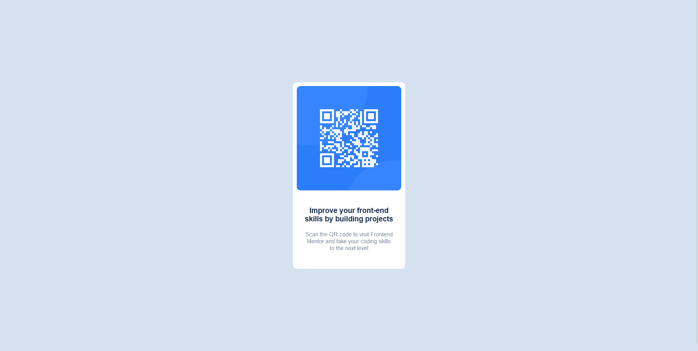
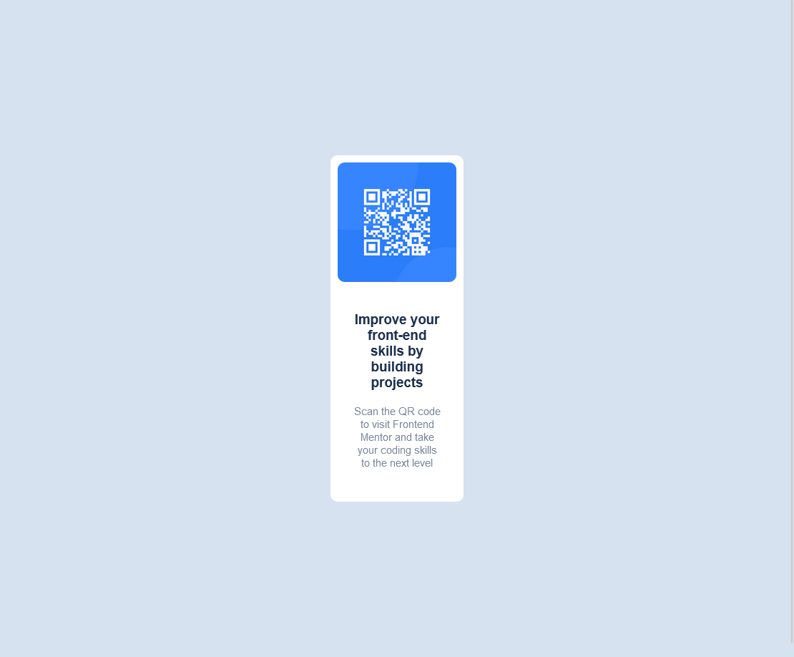

# Frontend Mentor - QR code component solution

This is a solution to the [QR code component challenge on Frontend Mentor](https://www.frontendmentor.io/challenges/qr-code-component-iux_sIO_H). 

## Table of contents

- [Overview](#overview)
  - [Screenshot](#screenshot)
  - [Links](#links)
- [My process](#my-process)
  - [Built with](#built-with)
  - [What I learned](#what-i-learned)
- [Author](#author)

## Overview

### Screenshot

### Links

- Solution URL: [Add solution URL here](https://github.com/TinyHero13/QR-code-component-Frontend-Mentor-Challange.github.io)
- Live Site URL: [Add live site URL here](https://your-live-site-url.com)

## My process

### Built with

- Semantic HTML5 markup
- CSS custom properties
- Flexbox

### What I learned

Practicing flexbox.

## Author

- Website - [Yasmim Abrahão](http://yasmimabrahao.live)
- Frontend Mentor - [@TinyHero13](https://www.frontendmentor.io/profile/TinyHero13)
- Twitter - [@yasmim_abrahao](https://twitter.com/yasmim_abrahao)
- Instagram [@yasmim_abrahao](https://www.instagram.com/yasmim_abrahao/)